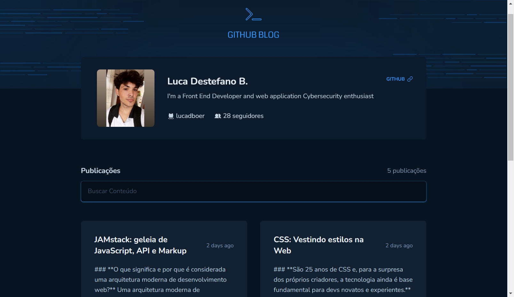
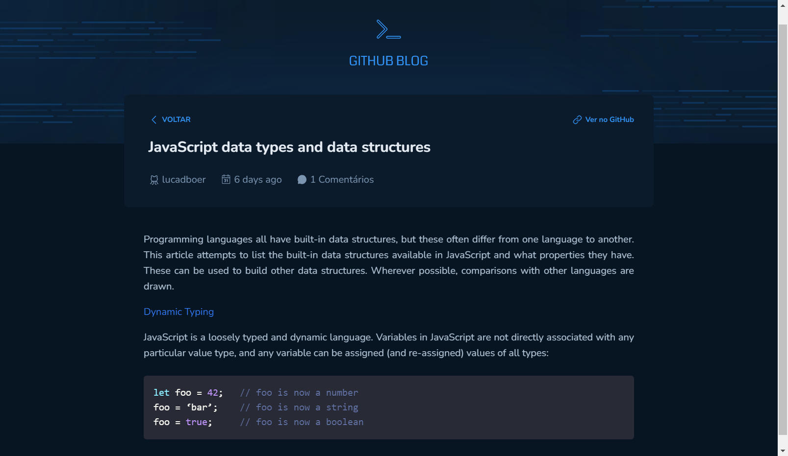

# GitHub Blog

O objetivo foi criar um blog que utiliza os dados do meu perfil de usuário do GitHub e também das issues deste projeto, onde cada issue tem uma publicação separada.

Além de todos os fundamentos do React, foi utilizado o axios para manipular chamadas HTTP, principalmente para buscar as informações através das API's do GitHub, também conceitos avançados de rotas do React Router Dom. Para a estilização foi aplicado os recursos do TailwindCSS

Third challenge developed on Rocketseat's Ignite track with ReactJS, Tailwind, TypeScript and Axios. The objective was to create a blog that uses data from my user profile and also from the issues of this project, where each edition has a separate publication.

In addition to all the fundamentals of React, axios was used to handle HTTP calls, mainly to fetch information through the GitHub APIs, as well as advanced concepts of routes from the React Router Dom. TailwindCSS features were applied for styling

## 🛠 Technologies

- React
- TypeScript
- TailwindCSS
- Axios
- Zod

## 🧑‍💻 Applications

- React Hooks
- Immutability
- React Router Dom
- React Hook Form
- Props
- Components
- API Consumption
- useCallback
- GitHub API

## 💛 Contact

- Email --> luca.boer@outlook.com
- Linkedin --> https://www.linkedin.com/in/luca-destefano-boer/
